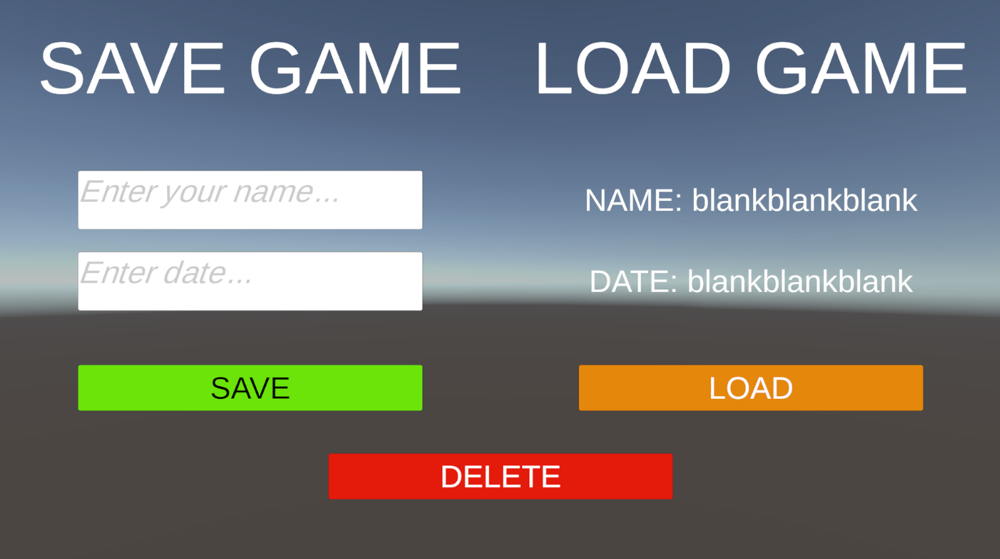

# Unity Basic Save System 
A simple and flexible **Save/Load/Delete system** for Unity projects.

## Features
- Saves data in **JSON** format.
- **Easy to use**: Save/Load with a single line of code.
- Works on Windows. (You can fix that yourself =))
- Optional file encryption support.
- Flexible architecture, easy to extend.

## Installation
1. **Clone the repo** or download as a ZIP:
   ```bash
      git clone https://github.com/P1wka/Unity-Basic-Save-System/
2. Add the ```SaveSystem``` folder to your Unity project.
3. Done! Ready to use.

## Usage
Create a script and base it on the SaveSystem class.

1. **Save Slot:**
   ```SaveSystem.SetData(DataInfo);```
2. **Load Slot:**
   ```var profileData = SaveSystem.GetData(slotIndex);```
3. **Delete Slot:**
   ```SaveSystem.DeleteSlot(slotIndex);```

There is sample usage example on project files.

Finally, this system is still under development, so its current state is very low-level.
Thanks for using! =)


